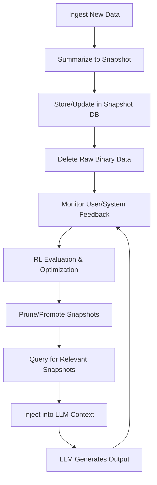

## LIVE CONTEXT

RAG (Retrieval-Augmented Generation) is, for all practical purposes, dead. RAG 2.0? Also dead. The future is not in static retrieval, but in **live context**—systems that integrate, adapt, and evolve context in real time.
No matter how hard we try, the context window of LLMs (Large Language Models) is bounded—by tokens, by time, by architecture. You can’t push context beyond the model’s hard limits. But what you *can* do is always bring the context down to the size of the model’s “mind”.

### THE MIND OF THE LLM

Think of an LLM’s mind as a mutable, reconfigurable, and even “washable” workspace. It’s powered by electricity, not data. Lose power, lose the mind—context gone. But this mind isn’t just static RAM; it’s a dynamic entity, shape by the data it processes and the interactions it has.

This is where **live contextualization** comes in. Imagine the LLM’s mind not as a static snapshot, but as a living, breathing entity—adapting and evolving in real time. The context is no longer a fixed set of data, but a dynamic, evolving memory, influenced by every new interaction.

> We forget, but that doesn’t make us stupid. We adapt by storing snapshots—mental images, compressed archives of experience. When we need them, we “unzip” these archives to inform our decisions. This is the essence of live contextualization.

---

#### WHY RAG FAILS AT SCALE

There are two approaches to RAG:

- **Small codebase:** RAG works because it can “start over” with each context window. The codebase fits, so the system performs at its peak—at first.
- **Large codebase:** RAG fails. The context window is too small. For example, Artifact’s commit messages alone are 100,000+ tokens. Most LLMs max out at 4,096 tokens. You can tweak settings, but you’re not fundamentally optimizing anything.

---

### EVOLUTION OF CONTEXT

To transcend RAG’s limitations, we need a system that is not just reactive, but proactive—one that learns, adapts, and optimizes itself with every run. This is achieved through a looped reinforcement learning (RL) architecture, tightly coupled with a smart data management layer.

#### SYSTEM OVERVIEW

1. **Continuous Ingestion & Summarization:**  
    - All incoming data (text, code, images, etc.) is ingested and immediately summarized into compact, information-rich snapshots.
    - Snapshots are stored in a dedicated database, indexed for rapid retrieval and versioned for traceability.

2. **Binary Data Lifecycle Management:**  
    - Raw binary data is retained only as long as necessary for snapshot creation.
    - Once a snapshot is validated and stored, the corresponding binary data is deleted, ensuring efficient storage and privacy.

3. **RL-Driven Context Loop:**  
    - The system operates as a closed loop:  
      a. **Observe:** Monitor user interactions, code changes, and system feedback.  
      b. **Summarize:** Generate or update snapshots reflecting the latest state.  
      c. **Evaluate:** Use RL signals (e.g., user satisfaction, task success) to assess which snapshots are most valuable.  
      d. **Optimize:** Refine snapshot selection and retrieval strategies based on feedback, improving with each iteration.

4. **Self-Evolving Snapshot Database:**  
    - The snapshot database is not static; it evolves as the system learns which summaries are most useful.
    - Old or low-value snapshots are pruned, while new, high-value ones are promoted.

5. **Contextual Injection & RAG 2.0:**  
    - When the LLM needs context, it queries the snapshot database for the most relevant, up-to-date summaries.
    - These are injected into the LLM’s context window, ensuring the model always operates with the freshest, most actionable information.
    - The database itself can be “RAGged”—queried and augmented—enabling multi-hop reasoning and deep contextualization.

6. **Smart Data Management:**  
    - All data flows are tracked and auditable.
    - Snapshots are encrypted, deduplicated, and compressed.
    - Data retention policies are enforced automatically.

---

#### LIVE CONTEXT RL LOOP

---

## CONCLUSION

RAG isn’t dead because it was a bad idea—it’s dead because it can’t scale with the complexity of real-world codebases. The future is **Live Context Augmentation**: a self-evolving, RL-driven system where the LLM’s mind is a living, adaptive entity, always optimizing itself, never limited by static context windows.

This might just be the way forward.
