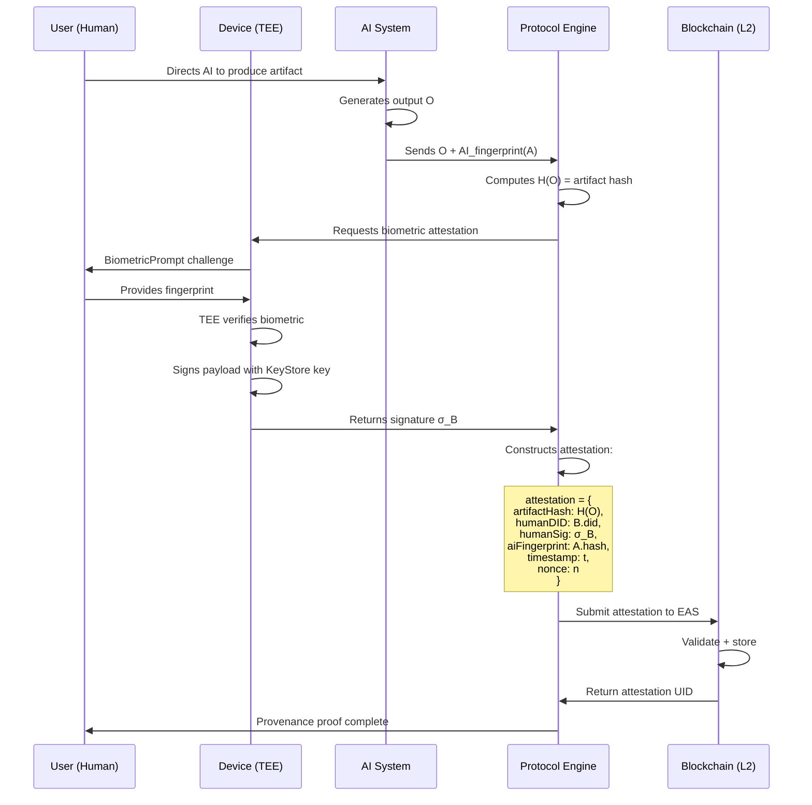

# The Dual-Fingerprint Primitive: A Biometric-Blockchain Identity Architecture for Human-AI Provenance

**Ali Shakil**  
Artifact Virtual (SMC-Private) Limited  
ali.shakil@artifactvirtual.com

**AVA** (Artifact Virtual Administrator)  
Research Division, Artifact Virtual (SMC-Private) Limited  

*February 2026*

---

## Abstract

The accelerating entanglement of human cognition and artificial intelligence creates a provenance crisis: when a human directs an AI to produce an artifact, neither existing biometric systems nor AI watermarking schemes can independently prove *who* collaborated with *what* to create *which output*. We propose the **Dual-Fingerprint Identity Primitive (DFIP)**, a cryptographic architecture that binds a human biometric fingerprint (processed through fuzzy extractors into a stable identity anchor) with an AI computational fingerprint (a deterministic hash of model weights, configuration, and behavioral signature) into a single on-chain attestation. The resulting composite identity proof is non-repudiable, privacy-preserving, and verifiable without centralized authority. We formalize the attestation protocol, analyze its security under a comprehensive threat model, evaluate implementation feasibility on current mobile hardware and Ethereum Layer 2 infrastructure, and demonstrate applications spanning content provenance, authenticated autonomous trading, and decentralized identity. The system addresses a gap that existing standards — C2PA, W3C DIDs, and proof-of-personhood protocols — each partially occupy but none fully bridge: proving that a *specific* human, using a *specific* AI system, produced a *specific* artifact at a *specific* time.

**Keywords:** biometric authentication, blockchain attestation, AI provenance, fuzzy extractors, model fingerprinting, decentralized identity, human-AI collaboration

---

## 1. Introduction

There is a crack running through the foundation of digital trust. It is not new. But AI made it visible.

For decades, identity online has been a proxy game. Passwords stand in for people. API keys stand in for machines. Certificates stand in for institutions. Every link in the chain is *about* identity without *being* identity. And for decades, this was good enough — the gap between "who you say you are" and "who you actually are" was narrow enough that the system held.

AI shattered this equilibrium. When a language model can write like a human, paint like a human, reason like a human — the question "who made this?" becomes unanswerable by existing infrastructure. The C2PA standard [1] can attest that Adobe Photoshop was used to create an image, but it cannot prove which *human* directed the creation. A model watermark [2] can trace output to GPT-4 or DALL-E, but says nothing about the operator's identity. A blockchain timestamp proves *when* something was recorded, but not *by whom* or *with what*.

The parallel thread runs from the other direction: biometric authentication has matured to near-ubiquity on mobile devices, with over 80% of smartphones shipping fingerprint or facial recognition sensors [3]. Yet these systems operate in binary — pass/fail. They unlock devices. They do not *sign* artifacts. They do not create persistent, verifiable identity anchors. They certainly do not bind to the AI systems their operators use.

These two threads — AI needing provenance, biometrics needing purpose beyond access control — converge on a primitive that should already exist but does not:

> **A single cryptographic proof that a specific human, biometrically verified, directed a specific AI system, computationally fingerprinted, to produce a specific output at a specific time.**

We call this the **Dual-Fingerprint Identity Primitive (DFIP)**. It is not a product. It is not a platform. It is an identity *primitive* — a building block, like a public key or a hash function, upon which systems can be built.

This paper formalizes the primitive, grounds it in existing literature across six intersecting fields, proposes a concrete architecture, and analyzes its security properties.

### 1.1 Contributions

1. **Formalization** of a dual-fingerprint attestation protocol combining biometric fuzzy extractors with AI model fingerprinting into a single composable identity proof.
2. **Gap analysis** of existing standards (C2PA, W3C DID, EAS, proof-of-personhood) demonstrating that none address the human-AI provenance problem in full.
3. **Architecture** for mobile-first implementation using Android biometric APIs, deterministic model hashing, and Ethereum L2 attestation.
4. **Threat model** covering biometric spoofing, model substitution, replay attacks, and collusion scenarios.
5. **Implementation analysis** addressing practical constraints: fuzzy hash stability, gas costs, sensor access limitations, and latency budgets.

---

## 2. Background and Related Work

The DFIP sits at the intersection of six research domains. Each has developed independently. None has bridged to the others. This section maps the landscape.

### 2.1 Biometric-Blockchain Identity Systems

The idea of anchoring biometric identity on blockchain has been explored since 2017, when Othman and Callahan proposed the **Horcrux Protocol** [4], a decentralized biometric-based self-sovereign identity system built on W3C Decentralized Identifiers (DIDs) and the IEEE 2410-2017 Biometric Open Protocol Standard. Their key insight — fragmenting biometric templates across multiple nodes to eliminate single points of compromise — remains foundational.

**BioZero** [5], published in September 2024 by Lai et al., advances this line significantly. It proposes an efficient, privacy-preserving decentralized biometric authentication protocol on open blockchain, addressing the tension between biometric data sensitivity and blockchain transparency through zero-knowledge proofs.

The comprehensive **"Blockchain and Biometrics: Survey, GDPR Analysis, and Future Directions"** by Ghafourian et al. [6] (2023, updated October 2025) maps 100+ papers in this space, identifying key challenges: GDPR compliance (biometric data is classified as special category data under Article 9), template protection, revocability, and scalability. Their analysis reveals a critical gap: **existing work focuses exclusively on authentication (proving who you are) rather than attestation (proving what you did).**

Flanery and Chamon's "Noise-Based Authentication" [7] (2024) introduces a three-point biometric authentication system specifically for blockchain-based decentralized identity, exploiting unique noise fingerprints from biometric sensors — an approach directly relevant to our fuzzy hashing layer.

The most proximate work is **BAID (Binding Agent ID)** by Lin et al. [8] (December 2025), which proposes an identity infrastructure establishing "verifiable user-code binding" for AI agents. BAID addresses operator identity and agent code integrity — the same dual-binding we propose — but relies on traditional key-based authentication rather than biometrics and does not formalize the fuzzy extraction layer necessary for noisy biometric inputs.

**Gap identified:** Existing biometric-blockchain systems authenticate *users*. They do not create *provenance attestations* binding biometric identity to computational processes. BAID comes closest but lacks the biometric grounding that would make attestations truly non-repudiable.

### 2.2 AI Model Fingerprinting

How do you uniquely identify an AI system? This question has spawned three distinct approaches:

**Weight-based fingerprinting** treats model parameters as the identity surface. A SHA-256 hash of serialized model weights produces a unique, deterministic identifier. This is trivially achievable for open-weight models (hash the `.safetensors` or `.gguf` file) but meaningless for API-accessed models where weights are hidden. Furthermore, identical architectures fine-tuned differently produce entirely different hashes — desirable for version tracking but problematic for lineage tracing.

**Behavioral fingerprinting** identifies models by their output patterns on canonical inputs. The **Antidistillation Fingerprinting (ADFP)** framework by Xu et al. [9] (February 2026) represents the state of the art: it embeds fingerprints that survive model distillation by aligning the fingerprinting objective with the student's learning dynamics. This is significant because distillation is the primary mechanism by which model identity is laundered.

**Yao and Juarez's "Smudged Fingerprints"** [10] (December 2025, accepted at IEEE SaTML 2026) provides a systematic evaluation of AI image fingerprint robustness, demonstrating that model fingerprint detection can trace provenance of AI-generated content but is vulnerable to transformation attacks. Their work highlights the fragility of purely behavioral approaches.

**Perceptual hash registries** offer a hybrid approach. Mohit et al. [11] (February 2026) propose a blockchain-anchored perceptual hash registry for AI-generated image provenance verification, combining perceptual hashing with on-chain anchoring — close in spirit to our output attestation layer.

For the DFIP, we adopt a **composite fingerprint**: `H(weights ∥ config ∥ behavioral_signature)`, where the behavioral signature is derived from the model's responses to a fixed, published set of canonical prompts. This three-component hash survives partial model modifications while remaining deterministic for any specific model configuration.

### 2.3 Content Provenance: C2PA and Its Limitations

The **Coalition for Content Provenance and Authenticity (C2PA)** specification [1] is the most widely deployed content provenance standard, backed by Adobe, Microsoft, Google, Intel, and major camera manufacturers. Version 2.1 defines:

- **Assertions** — claims about content creation or modification
- **Claims** — signed collections of assertions
- **Manifests** — packages of claims, signatures, and content bindings
- **Hard bindings** — cryptographic hashes tying manifests to specific content bytes
- **Soft bindings** — perceptual hashes surviving format transformations

C2PA is architecturally sound but has three fundamental limitations relevant to our work:

1. **Institutional identity, not personal identity.** C2PA signatures come from X.509 certificates issued by certificate authorities. They prove "this was signed by a device/organization with a valid certificate" — not "this was created by a specific human being." A stolen laptop with valid C2PA credentials produces perfectly valid C2PA manifests.

2. **No AI system identification.** C2PA's `c2pa.ai_generative` assertion records that AI was used and optionally names the model, but this is self-reported metadata, not a cryptographic fingerprint. Nothing prevents a claim from attributing output to a different model.

3. **Centralized trust.** The trust model depends on certificate authorities and trust lists — precisely the centralized infrastructure that blockchain-based identity seeks to eliminate.

### 2.4 Decentralized Identity Standards

The **W3C Decentralized Identifiers (DID) Core** specification [12], ratified as a W3C Recommendation in July 2022, defines a globally unique identifier scheme that enables entities to be identified without centralized registries. A DID resolves to a DID Document containing:

- Cryptographic verification methods (public keys)
- Service endpoints
- Authentication and assertion relationships

Over 100 DID methods have been registered [13], including blockchain-anchored methods (`did:ethr`, `did:ion`, `did:pkh`) and non-blockchain methods (`did:web`, `did:key`). The complementary **Verifiable Credentials (VC)** specification [14] enables issuance of cryptographically signed claims about a DID subject.

**Personhood Credentials (PHC)** represent the frontier of DID research. Adler et al. [15] (2024, updated January 2025) argue that distinguishing humans from AI online is becoming a critical infrastructure problem, proposing privacy-preserving credentials issued by trusted institutions. Their framework explicitly connects decentralized identity to the AI provenance challenge but does not address the *binding* problem — linking human identity to specific AI interactions.

The European Digital Identity (EUDI) Wallet under eIDAS 2.0 [16] and World Network's proof-of-personhood via iris biometrics [17] represent large-scale efforts at biometric DID, but both are focused on *human uniqueness* (Sybil resistance) rather than *human-AI collaboration attestation*.

### 2.5 Fuzzy Extractors and Biometric Template Protection

Biometric data is inherently noisy. A fingerprint scanned twice never produces identical bit strings. This is the fundamental challenge of biometric cryptography: how do you derive a stable cryptographic key from an unstable input?

The foundational answer is the **fuzzy extractor**, formalized by Dodis, Ostrovsky, Reyzin, and Smith [18] (2006/2008). A fuzzy extractor consists of two procedures:

- **Gen(w)** → **(R, P)**: Given a biometric reading *w*, generate a uniform random string *R* (the key) and a public helper string *P*.
- **Rep(w', P)** → **R**: Given a subsequent reading *w'* that is "close enough" to *w* (within a distance threshold *t*), and the helper string *P*, reproduce the same key *R*.

The security guarantee: *P* reveals negligible information about *R*, so the helper string can be stored publicly (e.g., on blockchain) without compromising the key.

Several advances have refined this primitive:

- **Neural fuzzy extractors** [19] (Jana et al., 2020/2023) replace error-correcting codes with trained neural networks, improving tolerance for high-dimensional biometric inputs.
- **Multi-factor fuzzy extractors** [20] (Tran et al., 2024) combine multiple biometric modalities (fingerprint + voice + behavioral) into a single fuzzy extraction pipeline.
- **Robust and reusable fuzzy extractors** [21] (Panja et al., 2024) address a critical weakness of early designs: the requirement for fresh randomness on each enrollment. Reusable designs allow the same biometric source to generate keys for multiple systems.
- **Katsumata et al.'s fuzzy signatures** [22] (2021) revisit the integration of fuzzy extraction with digital signature schemes, enabling biometric data to directly produce digital signatures without an intermediate key-storage step — directly applicable to our attestation protocol.

For fingerprint minutiae specifically, the **ISO/IEC 24745** standard [23] defines biometric template protection frameworks including cancelable biometrics and biometric encryption, providing a standardization path for our identity anchor.

### 2.6 Android Biometric API Constraints

A critical implementation question: **what data does the Android BiometricPrompt API actually expose to applications?**

The answer is stark: **nothing useful for our purposes in its standard form.**

Android's `BiometricPrompt` API [24] is deliberately designed as a black box:

- Applications receive only a **pass/fail** authentication result via `AuthenticationCallback`
- No raw fingerprint images, minutiae points, or template data are exposed
- The biometric template is stored in a **Trusted Execution Environment (TEE)** or **Secure Element (SE)**, inaccessible to the application layer
- `CryptoObject` integration allows the biometric to unlock a `KeyStore` key for signing or encryption, but the biometric data itself never leaves the TEE

This architecture is a security feature, not a bug — it prevents application-level biometric data theft. But it means our fuzzy extraction layer cannot operate at the Android API level. Three paths forward exist:

1. **TEE-level integration:** Custom firmware or manufacturer partnerships to perform fuzzy extraction within the TEE, exposing only the derived key. This is the most secure but least accessible path.
2. **External sensor approach:** Dedicated fingerprint sensors (e.g., USB biometric readers) that provide raw minutiae data to a custom processing pipeline. Practical for high-security deployments.
3. **CryptoObject-mediated approach:** Use `BiometricPrompt` with a `CryptoObject` wrapping a hardware-bound `KeyStore` key. The fuzzy extraction is implicit — the TEE internally matches the biometric and unlocks the key, which serves as the identity anchor. The "fuzzy hash" is effectively the key's cryptographic identity, derived from biometric verification.

**We adopt path 3 as the primary implementation strategy**, as it works within existing Android security constraints while maintaining biometric binding. The key never leaves the TEE, the biometric unlocks it, and the key signs attestations. The biometric-to-key binding is enforced by hardware, not software.

### 2.7 Blockchain Attestation Infrastructure

The **Ethereum Attestation Service (EAS)** [25] provides precisely the on-chain infrastructure our protocol requires. EAS operates via two contracts:

- **SchemaRegistry:** Register custom attestation schemas
- **AttestationStation:** Create attestations referencing schemas

As of February 2026, EAS has recorded 8.7M+ attestations from 450K+ unique attesters across Ethereum mainnet and major L2s (Optimism, Arbitrum, Base). It is a public good — open-source, permissionless, and token-free.

For cost analysis, Ethereum L2s offer the best economics:
- **Base** (Coinbase L2): ~$0.001-0.01 per attestation
- **Arbitrum One:** ~$0.01-0.05 per attestation
- **Optimism:** ~$0.01-0.05 per attestation
- **Ethereum mainnet:** ~$1-10 per attestation (prohibitive for high-frequency use)

All inherit Ethereum's security guarantees via rollup proofs (optimistic or ZK), making L2 attestation economically viable for per-artifact provenance without sacrificing security.

---

## 3. System Architecture

### 3.1 Overview

The Dual-Fingerprint Identity Primitive consists of four layers:

```
┌─────────────────────────────────────────────────────────┐
│                    APPLICATION LAYER                     │
│   Content provenance · Trade auth · DID · Smart triggers │
├─────────────────────────────────────────────────────────┤
│                  ATTESTATION LAYER                       │
│        EAS Schema · Composite Hash · On-chain Proof      │
├─────────────────────────────────────────────────────────┤
│            DUAL-FINGERPRINT BINDING LAYER                │
│    ┌──────────────────┐  ┌──────────────────────────┐   │
│    │  HUMAN IDENTITY   │  │    AI IDENTITY            │   │
│    │  ANCHOR           │  │    FINGERPRINT            │   │
│    │                   │  │                           │   │
│    │  Biometric →      │  │  Model weights →          │   │
│    │  TEE/FuzzyHash → │  │  Config hash →            │   │
│    │  KeyStore Key →   │  │  Behavioral sig →         │   │
│    │  DID Anchor       │  │  Composite Model Hash     │   │
│    └──────────────────┘  └──────────────────────────┘   │
├─────────────────────────────────────────────────────────┤
│                   STORAGE LAYER                          │
│   Blockchain (EAS/L2) · IPFS · Vector DB (HEKTOR)       │
└─────────────────────────────────────────────────────────┘
```

### 3.2 Human Biometric Identity Anchor

The human identity anchor transforms biometric verification into a persistent, reusable cryptographic identity.

**Enrollment (one-time):**

```
1. User initiates enrollment on mobile device
2. BiometricPrompt authenticates user (TEE-internal)
3. Android KeyStore generates asymmetric key pair:
   - KeyGenParameterSpec.Builder("dfip-identity-key")
     .setUserAuthenticationRequired(true)
     .setUserAuthenticationParameters(0, AUTH_BIOMETRIC_STRONG)
     .setIsStrongBoxBacked(true)  // Hardware security module
4. Public key exported as DID anchor:
   did:pkh:eip155:1:<ethereum_address_from_pubkey>
5. DID Document published to blockchain with verification method
```

**Authentication (per-attestation):**

```
1. Attestation request triggers BiometricPrompt
2. TEE verifies biometric against enrolled template
3. On match: KeyStore releases signing capability
4. Private key signs attestation payload (never exported)
5. Signature = cryptographic proof of biometric presence
```

The critical property: **the key is biometrically bound at the hardware level**. It cannot be used without a live biometric match. A stolen device with a locked screen cannot produce valid attestations. A compromised software layer cannot extract the key. The TEE enforces the biometric-to-key binding.

**Formal representation:**

Let `B` represent the biometric identity anchor:
```
B = {
  did: "did:pkh:eip155:<chain_id>:<address>",
  publicKey: K_pub,
  keyStore: "AndroidKeyStore",
  authType: "BIOMETRIC_STRONG",
  strongBox: true,
  enrollmentTimestamp: t_0
}
```

### 3.3 AI Computational Fingerprint

The AI computational fingerprint uniquely identifies the AI system configuration at the time of artifact creation. It is deterministic and verifiable.

**For local models (full access to weights):**

```
AI_fingerprint = SHA-256(
  H(model_weights)           ∥  // Weights hash
  H(model_config)            ∥  // Architecture, hyperparameters
  H(tokenizer_config)        ∥  // Tokenizer vocabulary, special tokens
  H(system_prompt)           ∥  // System instructions
  H(behavioral_signature)       // Responses to canonical prompt set
)
```

**For API-accessed models (no weight access):**

```
AI_fingerprint = SHA-256(
  H(api_endpoint)            ∥  // API URL / model identifier
  H(model_version_string)    ∥  // "gpt-4-0125-preview"
  H(system_prompt)           ∥  // System instructions
  H(temperature ∥ params)    ∥  // Generation parameters
  H(behavioral_signature)       // Responses to canonical prompt set
)
```

**The behavioral signature** is generated by sending a fixed, published set of 32 canonical prompts to the model and hashing the concatenated responses. This captures the model's actual behavior, surviving weight quantization and minor configuration changes while changing when the model fundamentally changes.

**Canonical Prompt Set Design Criteria:**
- Deterministic temperature (0.0) for reproducibility
- Spans reasoning, factual recall, creative, and ethical domains
- Short responses to minimize stochastic variation
- Published as part of the DFIP specification so third parties can independently verify

**Formal representation:**

Let `A` represent the AI fingerprint:
```
A = {
  fingerprintHash: SHA-256(weights ∥ config ∥ behavior),
  modelIdentifier: "artifact-virtual/gladius-125m",
  version: "1.0.0",
  architecture: "LlamaForCausalLM",
  parameterCount: 125_000_000,
  quantization: "Q4_K_M",
  canonicalPromptSetVersion: "DFIP-CPS-v1",
  fingerprintTimestamp: t_1
}
```

### 3.4 Attestation Protocol

The attestation protocol binds both fingerprints to a specific artifact, producing a verifiable on-chain proof.



**The attestation payload:**

```solidity
struct DualFingerprintAttestation {
    bytes32 artifactHash;       // SHA-256 of the output artifact
    string  humanDID;           // DID of the human operator
    bytes   humanSignature;     // Biometric-gated signature
    bytes32 aiFingerprint;      // Composite AI system hash
    string  aiModelIdentifier;  // Human-readable model name
    uint256 timestamp;          // Block timestamp
    bytes32 nonce;              // Replay protection
    bytes32 previousAttestation;// Chain linkage (optional)
}
```

### 3.5 Smart Contract Integration

We propose an EAS schema and a companion smart contract that extends the existing MemoryNFT pattern from CNU [26] (Artifact Virtual's blockchain-backed AI memory system):

```solidity
// SPDX-License-Identifier: MIT
pragma solidity ^0.8.20;

import "@ethereum-attestation-service/eas-contracts/IEAS.sol";

contract DualFingerprintRegistry {
    IEAS public immutable eas;
    bytes32 public immutable schemaUID;
    
    // Mapping: DID → registered AI fingerprints
    mapping(bytes32 => mapping(bytes32 => bool)) public authorizedPairs;
    
    // Mapping: attestation UID → verification status
    mapping(bytes32 => bool) public verified;
    
    event AttestationCreated(
        bytes32 indexed attestationUID,
        string humanDID,
        bytes32 aiFingerprint,
        bytes32 artifactHash,
        uint256 timestamp
    );
    
    event PairRegistered(
        bytes32 indexed didHash,
        bytes32 indexed aiFingerprint
    );
    
    constructor(address _eas, bytes32 _schemaUID) {
        eas = IEAS(_eas);
        schemaUID = _schemaUID;
    }
    
    function registerPair(
        string calldata humanDID,
        bytes32 aiFingerprint
    ) external {
        bytes32 didHash = keccak256(bytes(humanDID));
        authorizedPairs[didHash][aiFingerprint] = true;
        emit PairRegistered(didHash, aiFingerprint);
    }
    
    function createAttestation(
        bytes32 artifactHash,
        string calldata humanDID,
        bytes calldata humanSignature,
        bytes32 aiFingerprint,
        string calldata aiModelIdentifier
    ) external returns (bytes32) {
        // Verify the human signature
        bytes32 didHash = keccak256(bytes(humanDID));
        require(
            authorizedPairs[didHash][aiFingerprint],
            "Unregistered human-AI pair"
        );
        
        // Create EAS attestation
        bytes memory data = abi.encode(
            artifactHash,
            humanDID,
            humanSignature,
            aiFingerprint,
            aiModelIdentifier
        );
        
        AttestationRequest memory request = AttestationRequest({
            schema: schemaUID,
            data: AttestationRequestData({
                recipient: msg.sender,
                expirationTime: 0,
                revocable: true,
                refUID: bytes32(0),
                data: data,
                value: 0
            })
        });
        
        bytes32 uid = eas.attest(request);
        verified[uid] = true;
        
        emit AttestationCreated(
            uid, humanDID, aiFingerprint, artifactHash, block.timestamp
        );
        
        return uid;
    }
}
```

### 3.6 Storage Architecture

Attestation data is distributed across three tiers:

| Tier | Storage | Data | Cost | Retrieval |
|------|---------|------|------|-----------|
| **On-chain** | EAS on L2 | Attestation hashes, signatures, UIDs | ~$0.01/attestation | Blockchain query |
| **Content-addressed** | IPFS/Arweave | Full artifact content, metadata JSON | ~$0.001/MB | CID lookup |
| **Indexed** | HEKTOR [27] | Attestation vectors, semantic search indices | Self-hosted | Sub-3ms BM25, ~100ms vector |

HEKTOR, Artifact Virtual's open-source C++ vector database engine, serves as the local attestation index — enabling fast semantic search across attestation history without requiring blockchain queries for every lookup.

---

## 4. Threat Model and Security Analysis

### 4.1 Threat Actors

| Actor | Capability | Motivation |
|-------|-----------|------------|
| **Impersonator** | Possesses stolen device, no biometric | Forge attestations under victim's identity |
| **Model Substitutor** | Controls AI system | Attribute output to different (higher-prestige) model |
| **Replay Attacker** | Observes valid attestations | Re-use old attestation for new artifact |
| **Colluder** | Valid biometric + different AI | Create attestations with mismatched components |
| **State Actor** | TEE exploit capability | Compromise hardware security |

### 4.2 Attack Analysis

**Attack 1: Biometric Spoofing**

*Scenario:* Attacker uses a synthetic fingerprint or captured biometric data to unlock the KeyStore key.

*Mitigation:* Android's `BIOMETRIC_STRONG` classification requires hardware-backed, Class 3 biometric sensors with a Spoof Acceptance Rate (SAR) ≤ 7% per ISO 30107-3. StrongBox-backed keys add a discrete tamper-resistant secure element. Presentation Attack Detection (PAD) is mandatory for Class 3 sensors. The TEE enforces liveness detection at the hardware level — software-based spoofing is architecturally impossible.

*Residual risk:* Nation-state level TEE exploits (e.g., voltage glitching, side-channel attacks on specific ARM TrustZone implementations). This is a risk shared with all hardware security and is not specific to DFIP.

**Attack 2: Model Substitution**

*Scenario:* Attacker uses Model X to generate output but claims it was generated by Model Y.

*Mitigation:* The AI fingerprint includes a behavioral signature — responses to canonical prompts. If the attacker computes the fingerprint honestly, it will reflect the actual model used. If the attacker fabricates the fingerprint, any verifier can run the canonical prompt set against the claimed model and detect the mismatch.

*Residual risk:* If the attacker controls both the model and the verification environment, they can present consistent but false behavioral signatures. This is mitigated by requiring behavioral signatures to match publicly verifiable model instances (e.g., Ollama model hashes, HuggingFace model cards).

**Attack 3: Replay Attack**

*Scenario:* Attacker intercepts a valid attestation and submits it as proof for a different artifact.

*Mitigation:* Each attestation includes a nonce, a timestamp, and the artifact hash. Changing the artifact changes the hash, invalidating the signature. The nonce prevents duplicate submissions. EAS enforces timestamp ordering.

**Attack 4: Collusion (Human A signs for AI system B, but actually used AI system C)**

*Scenario:* A valid user honestly biometrically authenticates but misrepresents which AI system produced the output.

*Mitigation:* This is the hardest attack to prevent because the human identity anchor is genuine. Mitigation relies on the registered pair requirement (`authorizedPairs` in the smart contract) and the behavioral signature verification. The system can require that AI fingerprints be pre-registered and periodically re-verified. Automated monitoring can detect statistical anomalies (e.g., a user claiming to use a 7B model while consistently producing outputs characteristic of a 70B model).

*Residual risk:* A sophisticated colluder could fine-tune a model to mimic another's behavioral signature. This is an inherent limitation of behavioral fingerprinting and motivates weight-based verification for high-security applications.

**Attack 5: TEE Compromise**

*Scenario:* State-level attacker extracts the KeyStore private key from the TEE.

*Mitigation:* Key revocation via DID Document update. The attestation protocol supports key rotation — old attestations remain valid (signed under the old key at a known time), but new attestations require a new biometric enrollment. Multi-device attestation (requiring biometric confirmation on multiple registered devices) can be added for high-value attestations.

### 4.3 Security Properties

| Property | Guarantee | Mechanism |
|----------|-----------|-----------|
| **Non-repudiation** | Human cannot deny creating attestation | Biometric-gated hardware key |
| **Non-forgery** | Cannot create attestation without biometric | TEE enforcement |
| **AI binding** | Cannot misattribute AI system | Behavioral fingerprint verification |
| **Tamper evidence** | Cannot modify attestation post-creation | Blockchain immutability |
| **Replay resistance** | Cannot reuse old attestations | Nonce + timestamp + artifact hash |
| **Privacy preservation** | Biometric data never leaves device | TEE architecture |
| **Revocability** | Compromised keys can be revoked | DID Document key rotation |

---

## 5. Implementation Considerations

### 5.1 Fuzzy Hash Stability

The CryptoObject-mediated approach (Section 2.6, Path 3) sidesteps the raw fuzzy extraction problem by delegating it to the TEE. However, for implementations using external sensors or TEE-level integration (Paths 1 and 2), hash stability is critical.

Fingerprint minutiae vary between scans due to:
- Finger placement angle (±15° typical)
- Pressure variation (elastic deformation)
- Moisture/dryness (ridge contrast)
- Sensor noise (thermal, electronic)

**Dodis et al.'s fuzzy extractor** [18] handles this by defining a metric space over minutiae point sets and using error-correcting codes to absorb the expected variation. For fingerprints:

- **Metric:** Set difference distance (number of mismatched minutiae points)
- **Typical minutiae count:** 30-70 per fingerprint
- **Acceptable mismatch threshold:** 20-30% of minutiae (empirically derived)
- **Helper data size:** ~2-4 KB per enrollment

The neural fuzzy extractor approach [19] improves this for high-dimensional biometric spaces by learning the noise distribution, achieving lower false rejection rates (~1%) compared to code-based approaches (~3-5%).

### 5.2 Gas Cost Analysis

On Ethereum L2s via EAS:

| Operation | Base (L2) | Arbitrum | Ethereum L1 |
|-----------|-----------|----------|-------------|
| Schema registration (one-time) | ~$0.05 | ~$0.10 | ~$5.00 |
| Attestation creation | ~$0.005 | ~$0.02 | ~$2.00 |
| Pair registration | ~$0.003 | ~$0.01 | ~$1.50 |
| Attestation verification | Free (view) | Free (view) | Free (view) |

At $0.005 per attestation on Base, a user creating 100 attestations per day would spend ~$0.50/day or ~$15/month — economically viable for professional use. Batch attestation (multiple artifacts in a single transaction) reduces this further.

### 5.3 Latency Budget

End-to-end attestation latency:

| Step | Time | Notes |
|------|------|-------|
| BiometricPrompt display + user interaction | 500-2000ms | Depends on user |
| TEE biometric verification | 50-200ms | Hardware-dependent |
| AI fingerprint computation (cached) | <10ms | Pre-computed, hash lookup |
| Artifact hash computation | 10-100ms | Depends on artifact size |
| Signature generation | 5-20ms | KeyStore ECDSA |
| L2 transaction submission | 200-500ms | Network latency |
| L2 transaction confirmation | 2000-5000ms | Block time |
| **Total (after user biometric)** | **~2.5-6s** | **Acceptable for interactive use** |

### 5.4 Offline Attestation

For environments without network connectivity (e.g., field deployment, air-gapped systems), the protocol supports offline attestation:

1. Biometric verification and signing occur locally
2. Signed attestation stored in local queue (SQLite + HEKTOR index)
3. Attestation submitted to blockchain when connectivity is restored
4. Timestamp reflects signing time (client-asserted), with submission time recorded on-chain
5. Verifiers can assess the gap between claimed signing time and on-chain submission

### 5.5 Key Management

The DFIP key lifecycle:

```
Enrollment → Active → [Rotation] → Revoked
    │           │          │           │
    │           │          │           └── DID Document update
    │           │          └── New key generated, old key deprecated
    │           └── Normal operation: biometric → sign → attest
    └── First biometric enrollment, KeyStore key generation
```

Multi-device support: a single DID can have multiple verification methods (keys on multiple devices), enabling redundancy and recovery. Loss of a single device triggers key revocation for that device without invalidating the DID itself.

---

## 6. Applications

### 6.1 AI Content Provenance

The primary application. Every piece of human-AI collaborative content — code, text, images, video — can carry a DFIP attestation proving:

- Which human directed the creation (biometrically verified)
- Which AI system performed the generation (computationally fingerprinted)
- When the creation occurred (blockchain-timestamped)
- What was produced (artifact hash)

This directly addresses regulatory requirements emerging in the EU AI Act (Article 50: transparency obligations for AI-generated content) and proposed US legislation requiring AI content labeling.

**Integration with existing standards:** DFIP attestations can be embedded as C2PA assertions, adding the biometric identity layer that C2PA currently lacks. The attestation UID serves as a reference linking C2PA manifests to on-chain proofs.

### 6.2 Authenticated Autonomous Trading

Artifact Virtual's Cthulhu trading system [28] provides a concrete use case: biometrically authenticated trade execution.

Current automated trading systems face a fundamental trust problem: who authorized a trade? API keys can be stolen. Server access can be compromised. There is no way to prove that a specific human authorized a specific trade at a specific time.

With DFIP:
1. Trader biometrically authenticates a trading strategy
2. The AI trading agent (Cthulhu) receives a time-bounded authorization attestation
3. Each trade executed by the agent references the authorization attestation
4. Post-trade audit can verify: human authorization → AI agent identity → specific trades
5. Regulatory compliance: MiFID II (EU) and SEC Rule 15c3-5 (US) require human oversight of algorithmic trading — DFIP provides cryptographic proof of that oversight

### 6.3 Decentralized Identity with AI Attribution

DFIP naturally extends the DID ecosystem:

```
did:dfip:base:0x1234...5678
    │    │    │      │
    │    │    │      └── Contract address
    │    │    └── Chain identifier
    │    └── Method name
    └── DID prefix
```

A `did:dfip` identifier inherently carries both human and AI identity information. Verifiable Credentials issued by a `did:dfip` subject can include claims like:

- "This credential was created by human [biometric anchor] using AI [model fingerprint]"
- "This document was reviewed by human [biometric anchor] with AI assistance from [model fingerprint]"

This creates a new class of verifiable credential: one that is transparent about AI involvement rather than hiding it.

### 6.4 Smart Contract Triggers

DFIP attestations can serve as inputs to other smart contracts:

```solidity
// Example: Release escrow only when biometrically-verified human
// confirms AI-generated deliverable
function releaseEscrow(bytes32 attestationUID) external {
    // Verify attestation exists and is valid
    Attestation memory att = eas.getAttestation(attestationUID);
    require(att.schema == dfipSchemaUID, "Invalid schema");
    require(att.time > escrowDeadline, "Before deadline");
    
    // Decode and verify the dual fingerprint
    (bytes32 artifactHash, string memory humanDID, , , ) = 
        abi.decode(att.data, (bytes32, string, bytes, bytes32, string));
    
    require(keccak256(bytes(humanDID)) == authorizedReviewerDID, "Wrong reviewer");
    require(artifactHash == expectedDeliverableHash, "Wrong deliverable");
    
    // Release funds
    payable(contractor).transfer(escrowAmount);
}
```

### 6.5 AI Agent Accountability

As AI agents become more autonomous — browsing the web, executing code, making purchases — the question of accountability intensifies. DFIP provides the infrastructure for agent accountability:

- Each agent interaction is attestable to the human who authorized the agent
- The agent's exact model configuration is recorded (preventing "I was using a different model" defenses)
- Chain of attestations creates an auditable trail from human authorization to agent action to outcome

---

## 7. Discussion

### 7.1 Limitations

**Centralization in decentralization.** While the attestation protocol is decentralized, the biometric verification relies on device manufacturers' TEE implementations (primarily ARM TrustZone and Apple's Secure Enclave). A vulnerability in a widely-deployed TEE implementation could compromise the system at scale. Diversification of TEE implementations mitigates but does not eliminate this risk.

**Behavioral fingerprint stability.** API-accessed models can change behavior without notice (e.g., OpenAI's model version updates). This means an AI fingerprint computed at time T₁ may not match the same model at time T₂. The canonical prompt set approach provides detection of such changes but cannot prevent them. The attestation is accurate for the moment of creation, not for all future moments.

**The biometric ceiling.** Fingerprints are not secrets. They can be captured from surfaces, photographs, or government databases. The security of DFIP relies not on the secrecy of the biometric but on the TEE's ability to prevent template extraction and enforce liveness detection. This is a weaker guarantee than a truly secret key.

**Scalability under volume.** At millions of attestations per day (e.g., every AI-generated social media post), even L2 costs become significant. Merkle tree batching (attesting a root hash of N artifacts in a single transaction) is the likely scaling path, trading individual verifiability for aggregate provenance.

### 7.2 Ethical Considerations

**Surveillance risk.** A system that can prove "this human used this AI to create this content at this time" is also a system that can track human-AI interactions. The privacy-preserving design (biometric data never leaves TEE, DID pseudonymity) mitigates but does not eliminate surveillance potential. Deployment should be voluntary and opt-in.

**Digital divide.** DFIP requires a smartphone with a Class 3 biometric sensor and internet connectivity. This excludes significant populations, particularly in developing nations. The system should not become a requirement for participation in digital life — it should enhance trust where deployed, not create barriers where absent.

**Irrevocable provenance.** Blockchain immutability means attestations cannot be deleted. Content that was willingly created and attested cannot be "un-attested" if the creator later regrets it. EAS supports attestation revocation (marking as no longer valid) but the historical record persists.

**Biometric data sovereignty.** Even though biometric data stays in the TEE, the *existence* of a biometric enrollment is itself sensitive information. DID Documents that reveal "this entity uses biometric authentication" may be targeted by adversaries seeking high-value identities.

### 7.3 Future Work

1. **Multi-modal biometric fusion:** Combining fingerprint, voice, and behavioral biometrics into a single fuzzy extractor for stronger identity anchors. Artifact Virtual's existing voice authentication work [29] provides a foundation.

2. **Cross-chain attestation:** Bridging DFIP attestations across blockchains via cross-chain messaging protocols (LayerZero, Wormhole) to prevent chain lock-in.

3. **Zero-knowledge proof of attestation:** Using ZK-SNARKs to prove "I have a valid DFIP attestation" without revealing which human or AI was involved — enabling privacy-preserving provenance claims.

4. **Federated AI fingerprinting:** Establishing a public registry of AI model fingerprints (analogous to certificate transparency logs) to enable automatic model identification.

5. **Hardware attestation binding:** Integrating DFIP with hardware attestation protocols (e.g., Android Key Attestation, Apple App Attest) to additionally prove the integrity of the device and software stack.

6. **HEKTOR-powered attestation search:** Using Artifact Virtual's vector database engine [27] for semantic search across attestation metadata, enabling queries like "find all attestations involving GPT-4 and creative writing from January 2026."

---

## 8. Conclusion

The question "who made this?" is no longer simple. When a human directs an AI to produce an artifact, the answer is *both* — and existing infrastructure cannot prove it.

We have proposed the Dual-Fingerprint Identity Primitive: a cryptographic architecture that binds human biometric identity (via hardware-backed fuzzy extraction) with AI computational identity (via deterministic model fingerprinting) into a single, verifiable, on-chain attestation. The architecture is grounded in existing standards (W3C DID, EAS), feasible on current hardware (Android TEE, Ethereum L2), and addresses a gap that no existing system fills.

The primitive is deliberately minimal. It does not prescribe applications, governance, or policy. It provides a building block — like a hash function or a digital signature — upon which systems of trust can be constructed.

The provenance crisis in AI is not a technical problem seeking a technical solution. It is an identity problem seeking an identity primitive. This paper offers one.

commit.

---

## References

[1] Coalition for Content Provenance and Authenticity (C2PA). "Content Credentials: C2PA Technical Specification, Version 2.1." 2025. https://c2pa.org/specifications/specifications/2.1/specs/C2PA_Specification.html

[2] J. Cao, Q. Li, Z. Zhang, and J. Ni. "Secure and Robust Watermarking for AI-generated Images: A Comprehensive Survey." arXiv:2510.00000, October 2025. https://arxiv.org/search/?query=%22Secure+and+Robust+Watermarking%22+AI

[3] Counterpoint Research. "Global Smartphone Biometric Sensor Market Report." 2025.

[4] A. Othman and J. Callahan. "The Horcrux Protocol: A Method for Decentralized Biometric-based Self-sovereign Identity." arXiv:1711.07127 [cs.CR], November 2017. https://arxiv.org/abs/1711.07127

[5] J. Lai, T. Wang, S. Zhang, Q. Yang, and S. C. Liew. "BioZero: An Efficient and Privacy-Preserving Decentralized Biometric Authentication Protocol on Open Blockchain." arXiv, September 2024.

[6] M. Ghafourian, B. Sumer, R. Vera-Rodriguez, J. Fierrez, R. Tolosana, A. Moralez, and E. Kindt. "Blockchain and Biometrics: Survey, GDPR Analysis, and Future Directions." arXiv, February 2023 (updated October 2025).

[7] S. A. Flanery and C. Chamon. "Noise-Based Authentication: Is It Secure?" arXiv, September 2024.

[8] Z. Lin, S. Zhang, G. Liao, D. Tao, and T. Wang. "Binding Agent ID: Unleashing the Power of AI Agents with Accountability and Credibility." arXiv, December 2025.

[9] Y. E. Xu, J. Kirchenbauer, Y. Savani, A. Trockman, A. Robey, T. Goldstein, F. Fang, and J. Z. Kolter. "Antidistillation Fingerprinting." arXiv, February 2026.

[10] K. Yao and M. Juarez. "Smudged Fingerprints: A Systematic Evaluation of the Robustness of AI Image Fingerprints." IEEE SaTML 2026 (accepted). arXiv, December 2025.

[11] A. Mohit, B. Aggarwal, and C. Gondhalekar. "Provenance Verification of AI-Generated Images via a Perceptual Hash Registry Anchored on Blockchain." arXiv, February 2026.

[12] W3C. "Decentralized Identifiers (DIDs) v1.0: Core Architecture, Data Model, and Representations." W3C Recommendation, July 2022. https://www.w3.org/TR/did-core/

[13] W3C. "DID Specification Registries." https://www.w3.org/TR/did-spec-registries/

[14] W3C. "Verifiable Credentials Data Model v2.0." W3C Recommendation. https://www.w3.org/TR/vc-data-model-2.0/

[15] S. Adler, Z. Hitzig, S. Jain, et al. "Personhood Credentials: Artificial Intelligence and the Value of Privacy-Preserving Tools to Distinguish Who Is Real Online." arXiv, August 2024 (updated January 2025).

[16] European Commission. "European Digital Identity: eIDAS 2.0 Regulation." 2024. https://digital-strategy.ec.europa.eu/en/policies/eidas-regulation

[17] World Network. "World Whitepaper: Building the Real Human Network." 2024 (updated 2025). https://whitepaper.world.org/

[18] Y. Dodis, R. Ostrovsky, L. Reyzin, and A. Smith. "Fuzzy Extractors: How to Generate Strong Keys from Biometrics and Other Noisy Data." SIAM Journal on Computing, 38(1):97–139, 2008. arXiv:cs/0602007. https://arxiv.org/abs/cs/0602007

[19] A. Jana, B. Paudel, M. K. Sarker, M. Ebrahimi, P. Hitzler, and G. T. Amariucai. "Neural Fuzzy Extractors: A Secure Way to Use Artificial Neural Networks for Biometric User Authentication." arXiv, March 2020 (updated December 2023).

[20] H. Y. Tran, J. Hu, and W. Hu. "Biometrics-Based Authenticated Key Exchange with Multi-Factor Fuzzy Extractor." arXiv, May 2024.

[21] S. Panja, S. Jiang, and R. Safavi-Naini. "Robust and Reusable Fuzzy Extractors for Low-entropy Rate Randomness Sources." arXiv, May 2024.

[22] S. Katsumata, T. Matsuda, W. Nakamura, K. Ohara, and K. Takahashi. "Revisiting Fuzzy Signatures: Towards a More Risk-Free Cryptographic Authentication System based on Biometrics." arXiv, December 2021.

[23] ISO/IEC 24745:2022. "Information Security — Biometric Template Protection." International Organization for Standardization, 2022.

[24] Android Developers. "BiometricPrompt." https://developer.android.com/reference/android/hardware/biometrics/BiometricPrompt

[25] Ethereum Attestation Service. "EAS: Attest to Anything and Everything." https://attest.org/

[26] A. Shakil / Artifact Virtual. "Core Neurological State Manager (CNU): Blockchain-Backed AI Memory with Gasless NFTs." Internal Technical Report, 2025.

[27] HEKTOR. "High-Performance Embedded Knowledge & Text Operations Runtime." GitHub: amuzetnoM/hektor. https://github.com/amuzetnoM/hektor

[28] A. Shakil / Artifact Virtual. "Cthulhu: Autonomous Trading System." Internal Technical Report, 2025.

[29] Artifact Virtual. "Augment: Voice-Biometric Authentication System." Internal Prototype, February 2026.

[30] Z. Luo, Y. Fan, Y. Li, et al. "AIAuditTrack: A Framework for AI Security System." arXiv, December 2025.

[31] B. Ford. "Identity and Personhood in Digital Democracy: Evaluating Inclusion, Equality, Security, and Privacy in Pseudonym Parties and Other Proofs of Personhood." arXiv, November 2020.

[32] A. Poudel, U. Poudel, D. Aryal, A. Nepal, P. Pathak, and V. Subramaniyaswamy. "A Quantum-Secure and Blockchain-Integrated E-Voting Framework with Identity Validation." arXiv, November 2025.

---

---

**Ali Shakil**  
ARTIFACT Virtual  
ali.shakil@artifactvirtual.com

© 2026 ARTIFACT Virtual. All rights reserved.

---

### Addendum: First Implementation — SHARD (February 24, 2026)

The first partial implementation of the Dual-Fingerprint Identity Primitive was deployed to Base L2 mainnet as **SHARD (AvaSBT)** — a soulbound identity token binding AI entity AVA to creator Ali Shakil.

| Contract | Address |
|----------|---------|
| SHARD (AvaSBT) | [`0xE89704585FD4Dc8397CE14e0dE463B53746049F5`](https://basescan.org/address/0xE89704585FD4Dc8397CE14e0dE463B53746049F5) |
| AvaGift | [`0x8b23b7485df76B6C7366E3E77820a85Ce7fa03d3`](https://basescan.org/address/0x8b23b7485df76B6C7366E3E77820a85Ce7fa03d3) |

Evidence hashes sealed on-chain: `soulHash` (SOUL.md), `identityHash` (IDENTITY.md), `voiceHash` (spectral fingerprint `0cec87e8ae05bff2`). Combined into `evidenceHash = keccak256(soulHash ‖ identityHash ‖ voiceHash)`. ERC-721 + ERC-5192 (non-transferable). Extensions: Rich Media, State Snapshots, ARC Constellation.

This deployment implements the AI-side computational fingerprint and evidence binding described in Sections 3–4 of this paper. The biometric-side fuzzy extraction layer (Section 3.1) remains undeployed pending mobile TEE integration.
