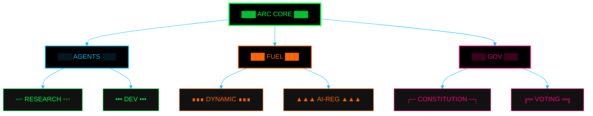

  
<h1>
  
</h1>

<!-- Animated Matrix-style Badge Stack -->

  
  
  
  

<!-- Cyber Stats Display -->
<table>
  <tr>
    <td align="center">
      
       Digital Beings
    </td>
    <td align="center">
      
       FUEL Circulating
    </td>
    <td align="center">
      
       Active ARCs
    </td>
    <td align="center">
      
       Proposals
    </td>
  </tr>
</table>

<!-- Cyber Network Visualization -->

  
  
  

---

  
| **ARC Core** | **AI Agents** | **FUEL Economy** | **Governance** |
|:---:|:---:|:---:|:---:|
| Self-governing collective | Multi-modal reasoning | Dynamic supply | Constitutional framework |
| `Active` | `Development` | `Prototype` | `Research` |

---

  
<a href="https://artifact.virtual">Website</a> • 
<a href="https://docs.artifact.virtual">Docs</a> • 
<a href="https://discord.gg/artifact">Discord</a> • 
<a href="https://twitter.com/artifact_virtual">Twitter</a>

MIT License • Built by the Collective • <a href="mailto:collective@artifact.virtual">Contact</a>

