ARTIFACT VIRTUAL <!-- Elegant Separator -->

<!-- Sophisticated Badge Stack with Blue Accents -->

  
  
  
  

<!-- Enhanced Technology Stack -->

  
  
  
  

*Building the foundational layer for autonomous reasoning systems,*  
*economic coordination, and collective intelligence*

<!-- Professional Action Buttons -->

  
  
  

<!-- Live Network Statistics -->
<table>
  <tr>
    <th>Digital Beings</th>
    <th>FUEL Circulating</th>
    <th>Active ARCs</th>
    <th>Network Health</th>
  </tr>
  <tr>
    <td align="center">
      
    </td>
    <td align="center">
      
    </td>
    <td align="center">
      
    </td>
    <td align="center">
      
    </td>
  </tr>
</table>

<!-- Architectural Overview -->

```mermaid
%%{init: {'theme':'dark', 'themeVariables': { 'primaryColor': '#1e40af', 'primaryTextColor': '#ffffff', 'primaryBorderColor': '#3b82f6', 'lineColor': '#60a5fa', 'secondaryColor': '#1f2937', 'tertiaryColor': '#374151', 'background': '#111827', 'mainBkg': '#1f2937'}}}%%
graph TB
    ARC[🧠 ARC Core<br/>Constitutional Framework] --> AGENTS[🤖 Agent Layer<br/>Multi-Modal Reasoning]
    ARC --> FUEL[💎 FUEL Protocol<br/>Economic Substrate]
    ARC --> GOV[⚖️ Governance<br/>Collective Intelligence]
    
    AGENTS --> RESEARCH[🔬 Research Agents]
    AGENTS --> DEV[⚙️ Development Agents]
    AGENTS --> INFRA[🏗️ Infrastructure Agents]
    
    FUEL --> SUPPLY[📊 Dynamic Supply]
    FUEL --> COORD[🔄 Economic Coordination]
    FUEL --> FUNDING[🎯 Public Goods Funding]
    
    GOV --> CONST[📜 Constitution]
    GOV --> VOTE[🗳️ Consensus Mechanisms]
    GOV --> RIGHTS[🛡️ Digital Rights]
    
    style ARC fill:#1e40af,stroke:#3b82f6,color:#ffffff
    style AGENTS fill:#2563eb,stroke:#60a5fa,color:#ffffff
    style FUEL fill:#3b82f6,stroke:#93c5fd,color:#ffffff
    style GOV fill:#1e40af,stroke:#3b82f6,color:#ffffff
```

**Laying foundations for a new kind of Civilization**

