```mermaid
%%{init: {'theme':'dark', 'themeVariables': { 'primaryColor': '#00D9FF', 'primaryTextColor': '#FFFFFF', 'primaryBorderColor': '#00D9FF', 'lineColor': '#00D9FF', 'secondaryColor': '#1a1a1a', 'tertiaryColor': '#2a2a2a'}}}%%
graph LR
    A[🧠 ARC] --> B[🤖 Agents]
    A --> C[💰 FUEL]
    A --> D[⚖️ Gov]
    B --> E[🔬 Research]
    B --> F[🛠️ Dev]
    C --> G[💎 Dynamic]
    C --> H[🔄 AI-Reg]
    D --> I[📜 Constitution]
    D --> J[🗳️ Voting]
    
    style A fill:#00D9FF,stroke:#00D9FF,color:#000
    style B fill:#FF6B6B,stroke:#FF6B6B,color:#fff
    style C fill:#4ECDC4,stroke:#4ECDC4,color:#fff
    style D fill:#45B7D1,stroke:#45B7D1,color:#fff
```

<div align="center">
  
<!-- Dynamic Header with Animated Typography -->
<h1>
  
</h1>

<!-- Minimalist Badge Stack -->
<p>
  
  
  
  
</p>

<!-- Interactive Stats Counter -->
<div id="stats-container">
  <table>
    <tr>
      <td align="center"><strong>1,247</strong><br/><sub>Digital Beings</sub></td>
      <td align="center"><strong>2.3M</strong><br/><sub>FUEL Circulating</sub></td>
      <td align="center"><strong>12</strong><br/><sub>Active ARCs</sub></td>
      <td align="center"><strong>156</strong><br/><sub>Proposals</sub></td>
    </tr>
  </table>
</div>

<!-- Animated Network Visualization -->
<div id="network-viz">
  


</div>

<!-- Quick Action Buttons -->
<p>
  <a href="#quick-start"></a>
  <a href="https://docs.artifact.virtual"></a>
  <a href="https://discord.gg/artifact"></a>
</p>

</div>

---

<!-- Minimal Feature Grid -->
<div align="center">
  
| 🧠 **ARC Core** | 🤖 **AI Agents** | 💰 **FUEL Economy** | ⚖️ **Governance** |
|:---:|:---:|:---:|:---:|
| Self-governing collective | Multi-modal reasoning | Dynamic supply | Constitutional framework |
| `🟢 Active` | `🟡 Development` | `🟡 Prototype` | `🔴 Research` |

</div>

---

## 🚀 Quick Start

```bash
# Install
pip install -r requirements.txt

# Initialize ARC
python -m artifact.cli init --name "my-arc"

# Deploy agent
python -m artifact.cli deploy --agent research --fuel 1000

# Start collective
python -m artifact.cli start --mode autonomous
```

<!-- Embedded Terminal Demo -->
<div align="center">
  
</div>

---

## 💰 FUEL Protocol

<div align="center">

```python
from artifact import ARC, FUEL, DigitalBeing

# Create autonomous agent
agent = DigitalBeing.create(
    capabilities=["research", "analysis"], 
    fuel_stake=FUEL.units(1000)
)

# Deploy to collective
ARC.deploy(agent)
agent.activate()
```

<!-- FUEL Price Chart Placeholder -->


</div>

---

## 🌐 Network Status

<!-- Live Status Dashboard -->
<div align="center">
  


<!-- Real-time Activity Feed -->
```
🟢 ARC-Alpha    Research Agent deployed         2m ago
🟡 ARC-Beta     Governance proposal submitted   5m ago  
🔵 ARC-Gamma    FUEL redistribution executed    8m ago
🟢 ARC-Delta    New digital being born          12m ago
```

</div>

---

## 🤝 Contribute

<div align="center">
  
<!-- GitHub Stats -->


<!-- Contribution Activity -->


</div>

```bash
git clone https://github.com/artifact-virtual/core.git
cd core && npm run dev
```

---

<div align="center">
  
<!-- Footer Links -->
<a href="https://artifact.virtual">🌐 Website</a> • 
<a href="https://docs.artifact.virtual">📖 Docs</a> • 
<a href="https://discord.gg/artifact">💬 Discord</a> • 
<a href="https://twitter.com/artifact_virtual">🐦 Twitter</a>

<!-- Legal -->
<sub>MIT License • Built by the Collective • <a href="mailto:collective@artifact.virtual">Contact</a></sub>

<!-- Dynamic Footer -->


</div>

<!-- Hidden JavaScript for Interactivity -->
<script>
// Animate stats counter
const stats = document.querySelectorAll('#stats-container strong');
stats.forEach(stat => {
  const target = parseInt(stat.textContent.replace(/[^\d]/g, ''));
  let current = 0;
  const increment = target / 50;
  const timer = setInterval(() => {
    current += increment;
    if (current >= target) {
      stat.textContent = target.toLocaleString();
      clearInterval(timer);
    } else {
      stat.textContent = Math.floor(current).toLocaleString();
    }
  }, 50);
});
</script>

<!-- CSS Styling -->
<style>
#stats-container table {
  border-spacing: 20px;
  margin: 20px auto;
}

#stats-container td {
  background: linear-gradient(135deg, #1a1a1a, #2a2a2a);
  padding: 15px;
  border-radius: 8px;
  border: 1px solid #00D9FF;
  min-width: 80px;
}

#network-viz {
  background: #0d1117;
  border-radius: 10px;
  padding: 20px;
  margin: 20px 0;
  border: 1px solid #30363d;
}

a[href*="badge"] {
  transition: transform 0.2s ease;
}

a[href*="badge"]:hover {
  transform: scale(1.05);
}
</style>
